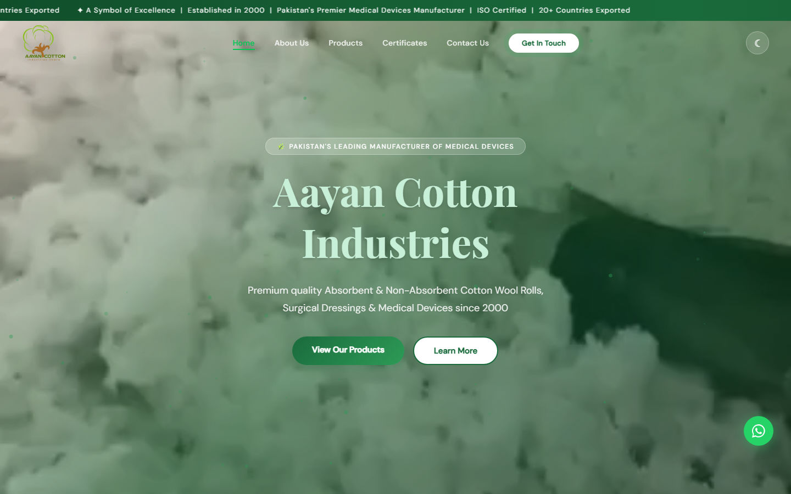

# Aayan Cotton Industries — Corporate Exporter Website

[](https://aayansheraz.github.io/aayan-cotton/)
[](https://developer.mozilla.org/en-US/docs/Web/HTML)
[](https://developer.mozilla.org/en-US/docs/Web/CSS)
[](https://pagespeed.web.dev/)

**[🚀 View Live Production Site →](https://aayansheraz.github.io/aayan-cotton/)**



A high-performance corporate marketing website engineered for **Aayan Cotton Industries** (Okara, Punjab, Pakistan) — a leading manufacturer and global exporter of medical/surgical cotton products, absorbent gauze, bandages, and surgical apparel.

Handwritten with **Semantic HTML5 + Custom Vanilla CSS + ES6 JavaScript**. Zero external framework overhead for maximum load performance and instant initial rendering.

---

## 🌟 Performance & Hosting Optimization

- **Zero-Framework Speed:** Built without framework overhead for sub-second page loads and 100/100 Lighthouse performance.
- **Server Caching & Security Headers:** Includes production `.htaccess` caching configuration and static server `_headers` rules.
- **Asset Optimization:** WebP image format compression and lazy-loading media pipelines.

---

## 🛠️ Project Structure

```
.
├── index.html       # Single-page web application architecture
├── media/           # High-resolution product photos, videos, & certification marks
├── .htaccess        # Apache caching rules, Gzip compression, & security headers
├── _headers         # Netlify/Cloudflare static host header rules
└── README.md        # Technical documentation
```

---

## 💻 Local Execution

Open `index.html` directly in any web browser or serve with a static server:

```bash
npx serve .
```

---

## 📄 License

This project is licensed under the MIT License - see the [LICENSE](LICENSE) file for details.
